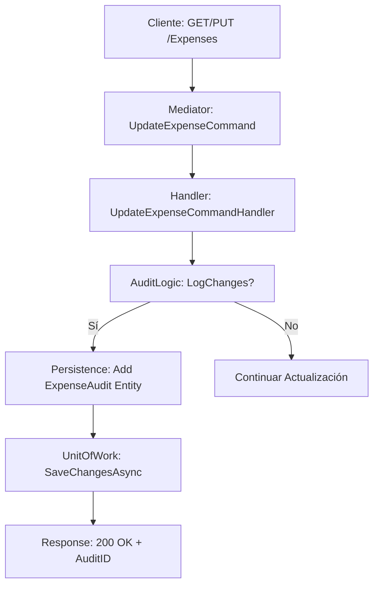
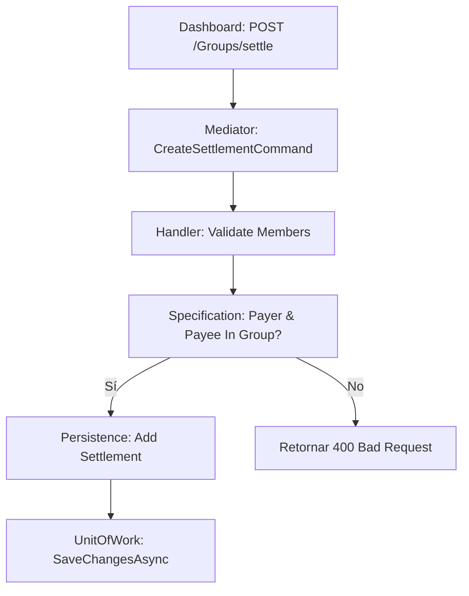
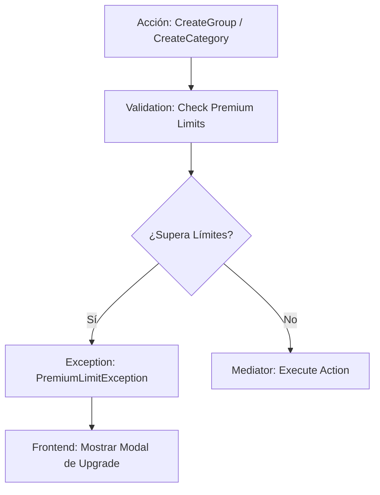

# 🏛️ Arquitectura Técnica de SplitMoney

Este documento detalla el funcionamiento interno de la API, los flujos de datos (CQRS) y las decisiones arquitectónicas clave que hacen de **SplitMoney** una solución financiera robusta.

---

## 🏗️ Patrón de Diseño: Arquitectura Cebolla (Onion)
La aplicación está dividida en capas concéntricas donde el **Dominio** es el centro absoluto.

1.  **Domain**: Entidades, interfaces y lógica de negocio pura.
2.  **Application**: Casos de uso (Mediator), Orquestación, Mapeos y Validación.
3.  **Persistence**: Acceso a datos (EF Core) y Repositorio Genérico.
4.  **Shared/Infrastructure**: Servicios transversales (Email, JWT, Auth).
5.  **WebApi**: El punto de entrada, controladores REST y documentación Swagger.

---

## 🔄 Flujos de Datos Clave (Mermaid)

### 1. Gestión de Gastos y Auditoría Premium
Cuando un usuario actualiza un gasto, el sistema automáticamente captura el cambio para el historial de transparencia.

### 2. Liquidación de Deudas (Settlements)
El flujo que permite reconciliar las cuentas entre miembros de un grupo.

### 3. Motor de Suscripciones (Freemium)
Control de acceso basado en el rol del usuario (`FreeUser` vs `PremiumUser`).

---

## 🛡️ Seguridad e Identidad
Implementamos una seguridad de nivel bancario basada en **Identity Framework** y **JWT Tokens**.

- **Authentication**: JWT dinámicos generados por `AuthService`.
- **Authorization**: Basada en Roles (`Admin`, `PremiumUser`, `FreeUser`) mediante el atributo `[Authorize(Roles = ...)]`.
- **Validation**: Cada comando es validado mediante **FluentValidation** antes de llegar al Handler.

---

## 📈 Lógica de Balances (BalanceEngine)
El motor de balances es dinámico y se basa en la suma neta de:
1.  **Gastos (+)**: Lo que el usuario puso para el grupo.
2.  **Splits (-)**: Lo que el usuario "consumió" y debe.
3.  **Settlements (+/-)**: Pagos realizados y recibidos para saldar deudas.

---
📄 *Documentación técnica generada para asegurar la escalabilidad del producto SplitMoney.*
