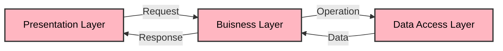

# Arquitectura Técnica

## Introducción
El presente documento describe la arquitectura técnica de una aplicación de gestión de gastos y presupuestos. La aplicación se compone de varias capas, incluyendo la capa de presentación, la capa de negocio y la capa de datos.

## Estilo de Arquitectura
La arquitectura de la aplicación sigue un estilo de arquitectura en capas, con las siguientes capas:

*   Capa de presentación: esta capa se encarga de la interacción con el usuario y la presentación de la información. Se utiliza el framework ASP.NET Core para crear la API RESTful.
*   Capa de negocio: esta capa se encarga de la lógica de negocio de la aplicación y se utiliza para validar los datos y realizar las operaciones necesarias. Se utiliza el patrón de diseño MediatR para implementar la lógica de negocio.
*   Capa de datos: esta capa se encarga de la persistencia de los datos y se utiliza para almacenar y recuperar los datos de la aplicación. Se utiliza Entity Framework Core para interactuar con la base de datos.

## Flujo de Datos
El flujo de datos en la aplicación es el siguiente:

1.  El usuario realiza una solicitud a la API RESTful.
2.  La solicitud se recibe en la capa de presentación y se valida.
3.  La solicitud se envía a la capa de negocio para que se realice la lógica de negocio necesaria.
4.  La capa de negocio realiza las operaciones necesarias y devuelve el resultado a la capa de presentación.
5.  La capa de presentación devuelve el resultado al usuario.

## Patrones de Diseño
La aplicación utiliza los siguientes patrones de diseño:

*   Patrón de diseño MediatR: se utiliza para implementar la lógica de negocio en la capa de negocio.
*   Patrón de diseño Repository: se utiliza para interactuar con la base de datos en la capa de datos.
*   Patrón de diseño Unit of Work: se utiliza para gestionar las transacciones en la capa de datos.

## Stack de Tecnologías
La aplicación utiliza las siguientes tecnologías:

| Tecnología | Descripción |
| --- | --- |
| ASP.NET Core | Framework para crear la API RESTful |
| MediatR | Patrón de diseño para implementar la lógica de negocio |
| Entity Framework Core | Framework para interactuar con la base de datos |
| SQL Server | Base de datos relacional |
| C# | Lenguaje de programación |

## Diagrama de la Arquitectura

La arquitectura de la aplicación se compone de tres capas: presentación, negocio y datos. La capa de presentación se encarga de la interacción con el usuario y la presentación de la información. La capa de negocio se encarga de la lógica de negocio de la aplicación y se utiliza para validar los datos y realizar las operaciones necesarias. La capa de datos se encarga de la persistencia de los datos y se utiliza para almacenar y recuperar los datos de la aplicación.
