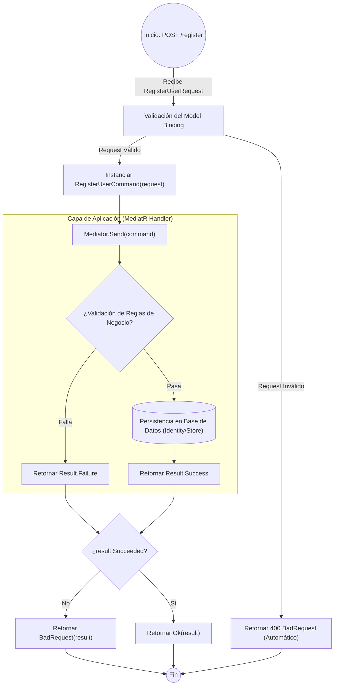

# ANÁLISIS TÉCNICO: MÉTODO REGISTER (AUTHCONTROLLER)

El método analizado corresponde a la acción de registro de usuarios (`Register`), que actúa como el punto de entrada para la creación de nuevas identidades en el sistema utilizando el patrón CQRS a través de **MediatR**.

## FLUJO DE EJECUCIÓN (FLOWCHART)

## ANÁLISIS DE COMPONENTES

| Componente | Responsabilidad Técnica |
| :--- | :--- |
| **Controller Action** | Punto de entrada desacoplado de la lógica de negocio. Solo orquestra el comando. |
| **MediatR (Mediator)** | Despacha el comando al manejador (`Handler`) correspondiente, eliminando dependencias directas. |
| **RegisterUserCommand** | DTO inmutable que transporta los datos de registro hacia la capa de aplicación. |
| **Result Pattern** | El objeto `result` encapsula el estado de la operación (éxito/error) y los mensajes asociados. |

## DETALLES DE LÓGICA
1.  **Validación Inicial**: Antes de entrar al método, ASP.NET Core valida que el cuerpo del JSON coincida con la estructura de `RegisterUserRequest`.
2.  **Abstracción**: El controlador no conoce la lógica de creación de usuarios (hashing de contraseñas, validación de emails duplicados, etc.); delega todo a `Mediator`.
3.  **Manejo de Respuesta**:
    *   Si `Succeeded` es `false`: Se retorna un **HTTP 400 (BadRequest)**, indicando fallos de validación o lógica de negocio.
    *   Si `Succeeded` es `true`: Se retorna un **HTTP 200 (Ok)** con la información del usuario creado o el token según la implementación del DTO.