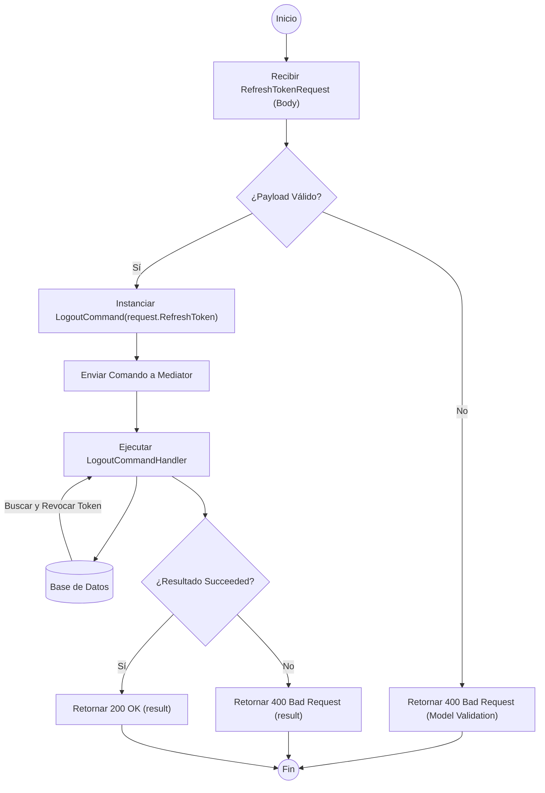

# ANÁLISIS TÉCNICO: MÉTODO LOGOUT (REVOCACIÓN) - AUTHCONTROLLER

El método analizado corresponde a la acción de **Logout**, la cual implementa el patrón **CQRS** mediante **MediatR**. Aunque el usuario se refiere a "Delete", en el contexto de autenticación proporcionado, el borrado lógico o revocación se ejecuta en el endpoint `/logout`.

## DIAGRAMA DE FLUJO DE EJECUCIÓN

## EXPLICACIÓN TÉCNICA DE LA LÓGICA

| COMPONENTE | DESCRIPCIÓN TÉCNICA |
| :--- | :--- |
| **Punto de Entrada** | Endpoint `POST /api/v1/auth/logout`. Recibe un objeto `RefreshTokenRequest`. |
| **Mediator** | Actúa como desacoplador entre el controlador y la lógica de negocio, enviando el `LogoutCommand`. |
| **Lógica de Comando** | El manejador (`Handler`) busca el token de refresco en la persistencia para invalidarlo (marcarlo como revocado o eliminarlo). |
| **Manejo de Estados** | El controlador no captura excepciones directamente, sino que confía en el objeto `result.Succeeded` para determinar el código de respuesta HTTP. |
| **Flujos de Error** | 1. Error de validación de modelo (automático). 2. Error de negocio (token inexistente o ya revocado), retornando `BadRequest`. |