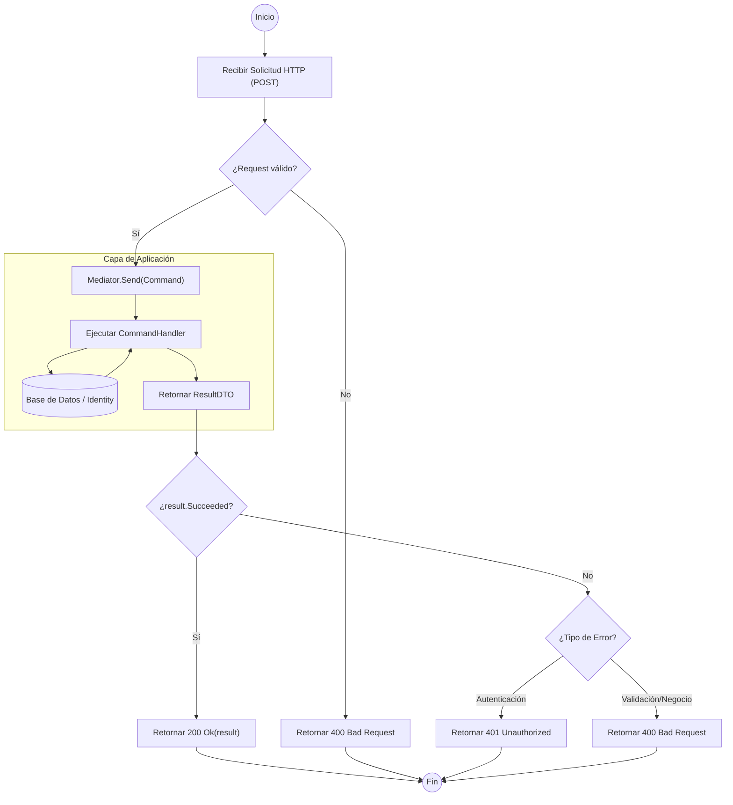

# Análisis Técnico de AuthController

El controlador `AuthController` implementa un patrón de diseño basado en **CQRS** utilizando la librería **MediatR**. Aunque el código proporcionado no contiene un método denominado `GetAll` (lo cual es consistente con un controlador de autenticación), todos sus métodos (`Login`, `Register`, `RefreshToken`, `Logout`) siguen una estructura lógica idéntica. 

A continuación se detalla el flujo de ejecución estándar para los métodos de este controlador.

## Diagrama de Flujo de Ejecución

## Análisis de la Lógica Operacional

El flujo del controlador se divide en cuatro etapas críticas:

1.  **Entrada y Enrutamiento**: El controlador utiliza `ApiVersion("1.0")` y hereda de `BaseApiController`. Los datos ingresan a través del cuerpo de la petición (`[FromBody]`).
2.  **Desacoplamiento (MediatR)**: El controlador no contiene lógica de negocio. Su única responsabilidad es transformar el DTO de entrada en un objeto `Command` y despacharlo a través de `Mediator.Send`.
3.  **Procesamiento**: La lógica reside en los *Handlers* de la capa de aplicación (mencionados en los `using`). Estos interactúan con los servicios de identidad y persistencia.
4.  **Manejo de Respuestas**: Se utiliza una evaluación ternaria basada en la propiedad `Succeeded` del objeto resultante para determinar el código de estado HTTP:
    *   `Succeeded == true`: Retorna `200 OK` con el contenido del resultado.
    *   `Succeeded == false`: Retorna `401 Unauthorized` (en Login/Refresh) o `400 Bad Request` (en Register/Logout).

## Resumen de Métodos Implementados

| Método | Comando Enviado | Error HTTP | Éxito HTTP |
| :--- | :--- | :--- | :--- |
| `Login` | `LoginCommand` | 401 Unauthorized | 200 OK |
| `Register` | `RegisterUserCommand` | 400 Bad Request | 200 OK |
| `RefreshToken` | `RefreshTokenCommand` | 401 Unauthorized | 200 OK |
| `Logout` | `LogoutCommand` | 400 Bad Request | 200 OK |