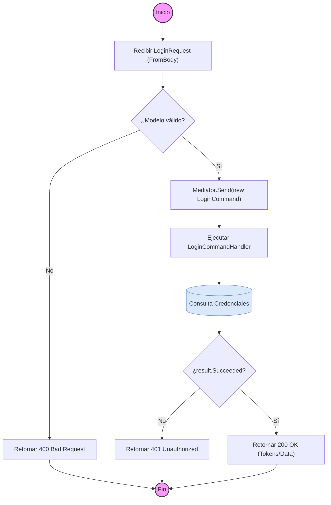

# ANÁLISIS TÉCNICO: AuthController - Método Login

El método `Login` implementa el patrón **Mediator** para desacoplar la capa de presentación (API) de la lógica de negocio. La ejecución delega la responsabilidad a un manejador de comandos (`CommandHandler`) que procesa la autenticación.

## Diagrama de Flujo de Ejecución (Mermaid)

## Descripción de la Lógica Operacional

### 1. Entrada y Validación Inicial
- El controlador recibe un objeto `LoginRequest`. 
- Aunque no es explícito en el código mostrado, el pipeline de ASP.NET Core y opcionalmente FluentValidation (común en esta arquitectura) validan que el objeto no sea nulo y cumpla con las reglas del DTO.

### 2. Desacoplamiento con MediatR
- Se instancia un `LoginCommand` pasando el request.
- `Mediator.Send` localiza el manejador correspondiente. Esto mantiene el controlador "delgado" (Thin Controller), cumpliendo con el principio de responsabilidad única.

### 3. Procesamiento (Capa de Aplicación)
- El manejador (Handler) interactúa con los servicios de identidad o base de datos para verificar:
    - Existencia del usuario.
    - Coincidencia de contraseña.
    - Estado de la cuenta (activo/bloqueado).
- Si la validación es correcta, se genera el JWT y/o Refresh Token.

### 4. Respuesta de Salida
| Condición | Código HTTP | Resultado |
| :--- | :--- | :--- |
| `result.Succeeded == true` | 200 OK | Retorna objeto con tokens y datos de perfil. |
| `result.Succeeded == false` | 401 Unauthorized | Retorna lista de errores (credenciales inválidas, etc.). |

### 5. Manejo de Errores
- El flujo contempla el camino de fallo mediante la propiedad `Succeeded`. 
- Si ocurre una excepción no controlada, el flujo sería capturado por un Middleware de Excepciones Global (no visible en el fragmento pero estándar en esta arquitectura).