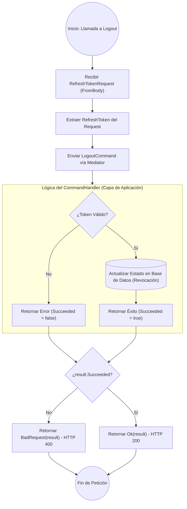

# ANÁLISIS TÉCNICO: MÉTODO LOGOUT EN AUTHCONTROLLER

El método `Logout` implementa un patrón de desacoplamiento mediante **MediatR**, delegando la lógica de negocio al comando `LogoutCommand`. Su función principal es la invalidación o revocación del *Refresh Token* proporcionado por el cliente.

### DIAGRAMA DE FLUJO DE EJECUCIÓN (MERMAID)

### ESPECIFICACIONES DE RESPUESTA

| Escenario | Condición Técnica | Código HTTP | Resultado Esperado |
| :--- | :--- | :--- | :--- |
| **Éxito** | `result.Succeeded == true` | 200 OK | Token invalidado correctamente en el sistema. |
| **Fallo de Validación** | `result.Succeeded == false` | 400 Bad Request | El token no existe, ya expiró o ya fue revocado. |
| **Error de Binding** | `request` nulo o malformado | 400 Bad Request | El middleware de ASP.NET Core intercepta antes de entrar al método. |

### DETALLES DE IMPLEMENTACIÓN
1.  **Mediador**: El controlador no conoce la lógica de persistencia; solo despacha la intención a `LogoutCommand`.
2.  **Seguridad**: El proceso se centra en el `RefreshToken`. A diferencia del JWT (AccessToken), el Refresh Token suele almacenarse en base de datos, permitiendo su revocación inmediata.
3.  **Manejo de Errores**: Se utiliza un objeto de respuesta unificado (`result`) que encapsula el estado de la operación, evitando el uso de excepciones para el flujo de control normal.