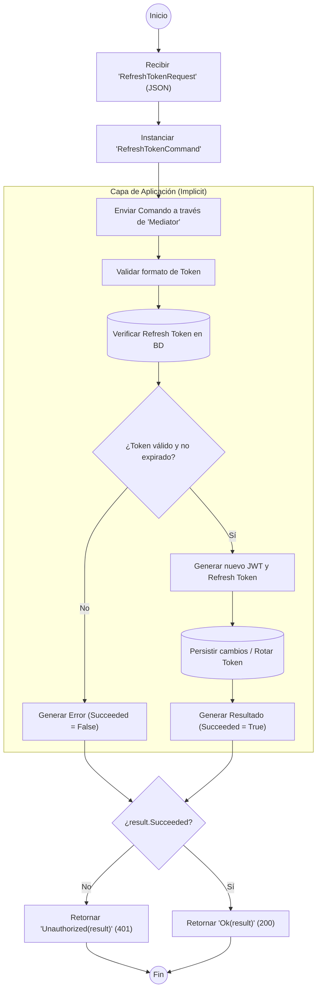

# ANÁLISIS TÉCNICO: AuthController.RefreshToken

El método `RefreshToken` actúa como un orquestador de entrada en una arquitectura limpia (Clean Architecture) utilizando el patrón **Mediator**. Su función principal es recibir una solicitud de renovación de credenciales y delegar la lógica de negocio a un manejador especializado.

### Flujo de Ejecución

### Componentes de la Solución

| Componente | Descripción Técnica |
| :--- | :--- |
| **AuthController** | Controlador de API versionado (v1.0) que hereda de `BaseApiController`. |
| **RefreshTokenRequest** | DTO que contiene el token de acceso expirado y el refresh token. |
| **Mediator (IMediator)** | Desacopla el controlador del manejador de comandos (Command Handler). |
| **RefreshTokenCommand** | Objeto encapsulado que transporta los datos necesarios para la ejecución del caso de uso. |
| **Result (IResult)** | Objeto de respuesta que encapsula el estado (`Succeeded`), mensajes y datos del nuevo token. |

### Lógica de Respuesta
1.  **Validación de Éxito**: Se evalúa la propiedad `Succeeded` del objeto devuelto por el Mediator.
2.  **Manejo de Errores**: Si la validación falla (token inválido, expirado o revocado), el controlador devuelve un código de estado HTTP **401 Unauthorized**, protegiendo el recurso.
3.  **Manejo de Éxito**: Si la operación es correcta, se retorna un HTTP **200 OK** con el nuevo par de tokens (Access Token y Refresh Token), permitiendo al cliente continuar su sesión sin re-autenticación manual.