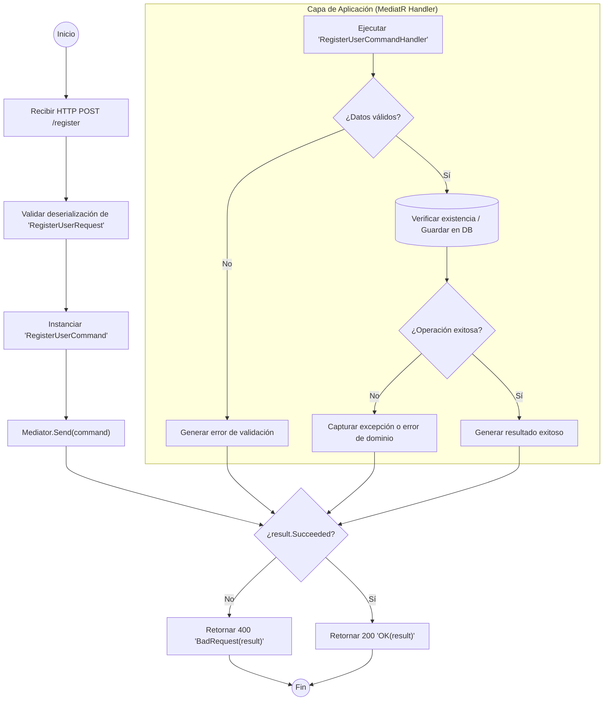

# ANÁLISIS TÉCNICO: AuthController.Register

El método `Register` actúa como un punto de entrada (Entry Point) que delega la responsabilidad de la lógica de negocio a un manejador de comandos mediante el patrón **Mediator**. A continuación, se detalla el flujo de ejecución desde la recepción de la solicitud hasta la respuesta final.

## Diagrama de Flujo de Ejecución

## Análisis de la Lógica

1.  **Recepción de Datos**: El controlador recibe un objeto `RegisterUserRequest`. La infraestructura de ASP.NET Core se encarga de la validación básica del formato (JSON).
2.  **Desacoplamiento**: Se utiliza `IMediator` para enviar un `RegisterUserCommand`. Esto separa la capa de transporte (Web API) de la capa de servicios/lógica de negocio.
3.  **Manejo de Respuesta**: El resultado (`result`) encapsula tanto el éxito como el fallo de la operación.
4.  **Flujos de Error**: 
    *   Si la propiedad `Succeeded` es `false`, se asume que hubo errores de validación, colisiones de datos (ej. email duplicado) o fallos de infraestructura, devolviendo un código de estado **400**.
5.  **Flujo de Éxito**: 
    *   Si la operación en la base de datos es confirmada, el sistema devuelve un código **200** junto con el objeto de respuesta definido en el comando.

### Tabla de Componentes

| Componente | Responsabilidad |
| :--- | :--- |
| `RegisterUserRequest` | DTO que transporta los datos de entrada del cliente. |
| `RegisterUserCommand` | Representación de la intención de registro dentro del dominio de la aplicación. |
| `Mediator` | Bus de mensajes interno que localiza el Handler correspondiente. |
| `Succeeded` | Propiedad booleana que determina el flujo de la respuesta HTTP. |