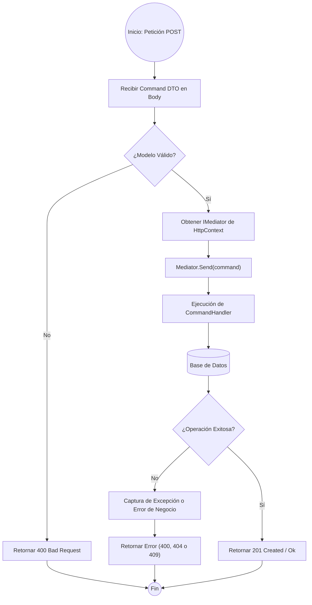

# ANÁLISIS TÉCNICO: MÉTODO CREATE EN BASEAPICONTROLLER

El flujo de ejecución de un método `Create` en un controlador que hereda de `BaseApiController` sigue el patrón **CQRS (Command Query Responsibility Segregation)** mediante la librería **MediatR**. El controlador actúa únicamente como un orquestador que delega la lógica de negocio a un manejador (Handler).

### FLUJO DE EJECUCIÓN (MERMAID)

### DESCRIPCIÓN DE LA LÓGICA DE EJECUCIÓN

| Etapa | Descripción Técnica |
| :--- | :--- |
| **Entrada** | El método `Create` recibe un objeto de comando (Command DTO) que contiene los datos necesarios para la persistencia. |
| **Inyección Lazy** | Se utiliza la propiedad protegida `Mediator` de `BaseApiController`. Si `_mediator` es nulo, se resuelve mediante el contenedor de servicios (`HttpContext.RequestServices`). |
| **Validación** | Se verifica la integridad de los datos mediante `Data Annotations` o `FluentValidation` antes de procesar el comando. |
| **Desacoplamiento** | El controlador no conoce la lógica de persistencia. Solo llama a `Mediator.Send()`, lo que dispara el `IRequestHandler` correspondiente. |
| **Persistencia** | El Handler interactúa con el repositorio o contexto de BD para almacenar la entidad. |
| **Respuesta** | Se retorna un código de estado HTTP 201 (Created) con la ruta del nuevo recurso o un código de error específico si la validación de negocio falla. |

### CONSIDERACIONES DE ERROR

1.  **Excepciones de Infraestructura:** Si la base de datos no está disponible, el flujo se desvía hacia el manejo global de excepciones (Middleware), retornando un HTTP 500.
2.  **Validación de Negocio:** Si el comando viola alguna regla (ej. duplicidad de registros), el Handler puede lanzar una excepción personalizada o retornar un objeto de resultado fallido, resultando en un HTTP 400 o 409.