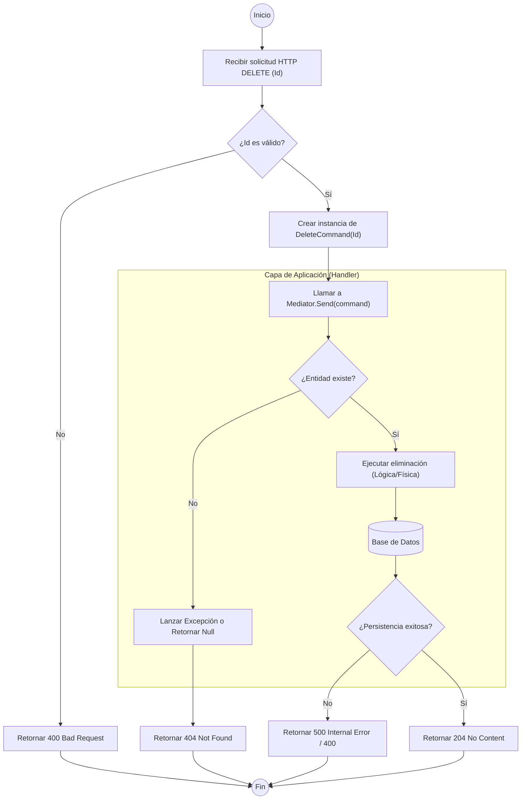

# ANÁLISIS TÉCNICO: MÉTODO DELETE EN BASEAPICONTROLLER

El método `Delete` en un controlador que hereda de `BaseApiController` utiliza el patrón **CQRS** mediante **MediatR**. La lógica se desacopla del controlador, delegando la responsabilidad a un manejador de comandos (Handler).

## DIAGRAMA DE FLUJO DE EJECUCIÓN

## DESGLOSE DE COMPONENTES LÓGICOS

| Componente | Función Técnica |
| :--- | :--- |
| **Controlador** | Actúa como punto de entrada. Inyecta `IMediator` de forma perezosa (Lazy Loading) mediante la propiedad `Mediator`. |
| **Command** | Objeto DTO que transporta el identificador del recurso a eliminar hacia la capa de aplicación. |
| **Mediator** | Despachador que desacopla la ruta HTTP de la lógica de negocio, localizando el `Handler` correspondiente. |
| **Handler** | Contiene la lógica: verifica existencia en BD, aplica reglas de borrado y coordina con el Repositorio/Unit of Work. |
| **Manejo de Errores** | Se gestiona usualmente mediante un Middleware global que captura excepciones de tipo `NotFoundException` o `ValidationException`. |

### ESPECIFICACIONES TÉCNICAS DEL FLUJO
1.  **Inyección de Dependencias**: El acceso a `IMediator` se realiza mediante `HttpContext.RequestServices`, lo que evita la inyección explícita en el constructor de cada controlador derivado.
2.  **Validación**: Antes de procesar, se valida la integridad del parámetro `Id`.
3.  **Respuesta HTTP**: 
    *   **204 (No Content)**: Es el estándar recomendado para eliminaciones exitosas que no retornan datos.
    *   **404 (Not Found)**: Si el recurso no existe en la base de datos.
    *   **400 (Bad Request)**: Si hay violaciones de integridad referencial o datos de entrada mal formados.