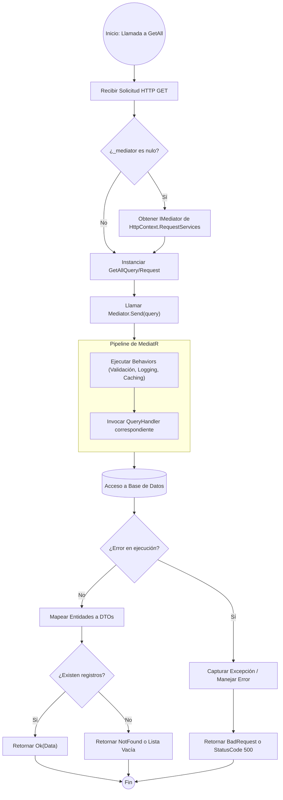

# ANÁLISIS TÉCNICO: MÉTODO GETALL EN BASEAPICONTROLLER

El método `GetAll` en un controlador que hereda de `BaseApiController` utiliza el patrón **Mediator** para desacoplar la capa de transporte de la lógica de negocio. La resolución del servicio se realiza mediante *Lazy Loading* a través del contenedor de dependencias de ASP.NET Core.

### Diagrama de Flujo de Ejecución (Mermaid)

### Explicación de la Lógica de Ejecución

| Fase | Descripción Técnica |
| :--- | :--- |
| **Resolución de Dependencias** | El `BaseApiController` utiliza el patrón de inyección de servicios por propiedad con evaluación perezosa. Si `_mediator` es nulo, se resuelve desde el `IServiceProvider` de la solicitud actual. |
| **Desacoplamiento** | El controlador no conoce la lógica de acceso a datos. Solo crea un objeto `Query` y lo envía al bus de mensajes (`MediatR`). |
| **Pipeline de MediatR** | Antes de llegar al manejador, la solicitud pasa por *Behaviors* que pueden realizar validaciones automáticas o gestión de logs. |
| **Manejo de Resultados** | La respuesta se encapsula usualmente en un objeto de resultado (como `Result<T>`) para estandarizar las respuestas HTTP (200, 400, 404) y la estructura de errores. |
| **Persistencia** | El `QueryHandler` interactúa con el `DbContext` o Repositorios para materializar la consulta, aplicando filtros de solo lectura (`AsNoTracking`). |