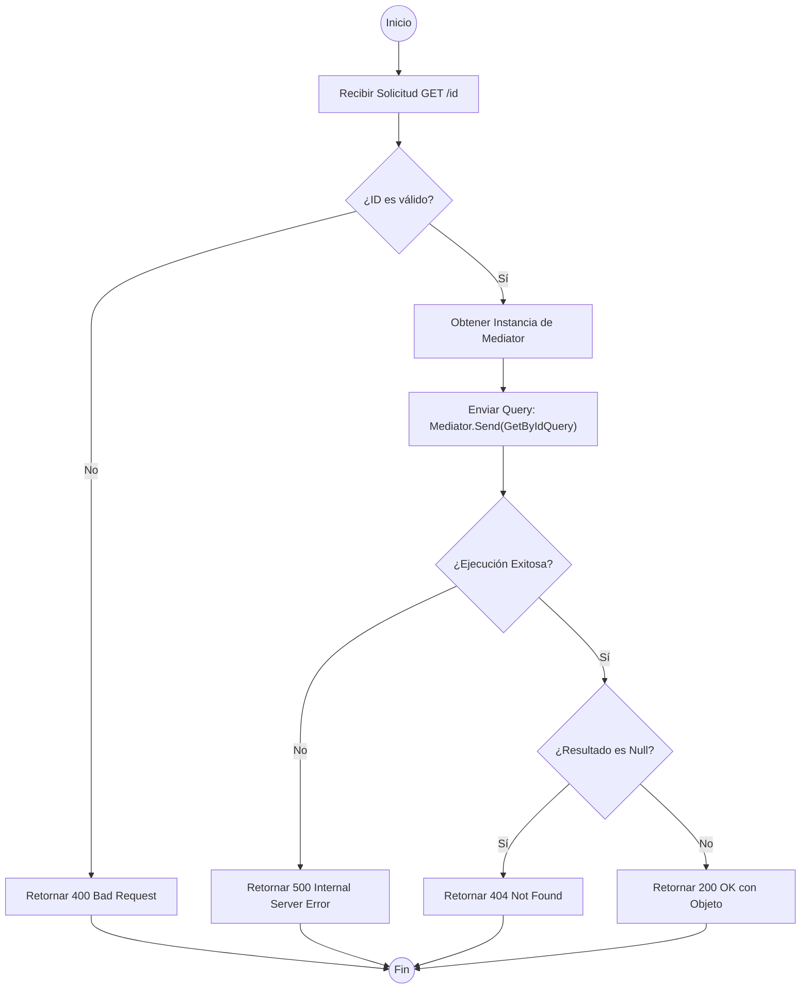

# Análisis de Ejecución: GetById en BaseApiController

Este análisis describe el flujo lógico estándar de un método `GetById` implementado en un controlador base que utiliza el patrón **MediatR** para la orquestación de comandos y consultas (CQRS).

## Diagrama de Flujo (Mermaid)

## Análisis Lógico del Proceso

| Etapa | Descripción Técnica |
| :--- | :--- |
| **Validación Inicial** | Se verifica que el parámetro `id` cumpla con el tipo de dato esperado (Guid/int). Si falla, el pipeline de ASP.NET Core o una validación explícita retorna `BadRequest`. |
| **Inyección de Mediator** | La propiedad `Mediator` utiliza *Lazy Loading*. Si `_mediator` es nulo, lo resuelve desde el `HttpContext.RequestServices`. |
| **Desacoplamiento (CQRS)** | El controlador no conoce la lógica de negocio. Solo empaqueta el `id` en un objeto `Query` y lo envía a través del bus de mensajes de MediatR. |
| **Manejo de Resultados** | Se evalúa la respuesta del *Handler*:  1. Si el objeto no existe, se retorna un código de estado **404**.  2. Si ocurre una excepción no controlada, el flujo deriva a un middleware de excepciones o retorna **500**. |
| **Respuesta Exitosa** | Se serializa el objeto DTO resultante y se entrega con un código de estado **200**. |