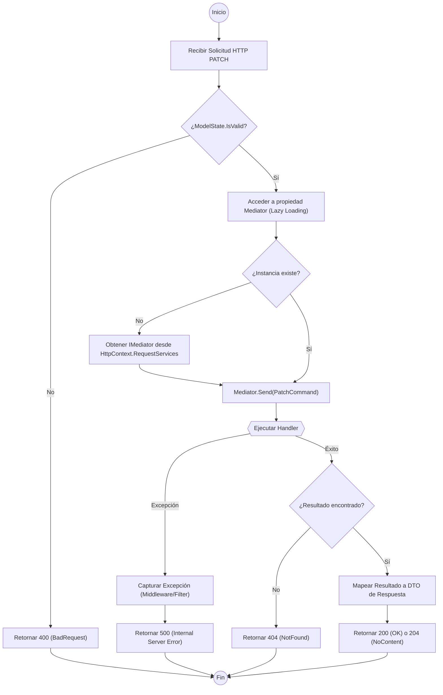

# Análisis del Flujo de Ejecución: Método Patch (BaseApiController)

El método `Patch` en un controlador base que utiliza **MediatR** sigue un patrón de delegación de responsabilidades. El controlador actúa únicamente como un orquestador de entrada/salida, mientras que la lógica de negocio y la mutación del estado se trasladan al `CommandHandler` correspondiente.

### Comparativa de Implementación: Tradicional vs. MediatR

| Característica | Enfoque Tradicional (Inyección Directa) | Enfoque BaseApiController + MediatR |
| :--- | :--- | :--- |
| **Dependencias** | Múltiples servicios inyectados en constructor. | Única dependencia: `IMediator`. |
| **Acoplamiento** | Alto acoplamiento con la lógica de negocio. | Bajo acoplamiento (Desacoplamiento por mensajes). |
| **Mantenibilidad** | Difícil de escalar al crecer los servicios. | Alta escalabilidad mediante "Slices" verticales. |
| **Carga de Memoria** | Instancia todos los servicios al iniciar el controlador. | Resolución "Lazy" (bajo demanda) del Mediator. |

---

### Diagrama de Flujo de Ejecución (Flowchart)

---

### Descripción Técnica del Proceso

1.  **Validación Inicial**: Antes de interactuar con el bus de mensajes, el framework valida la estructura del `JsonPatchDocument` o del comando enviado.
2.  **Resolución de Dependencia (Lazy Loading)**: La propiedad `Mediator` utiliza el operador de asignación compuesta nula (`??=`). Si la variable privada `_mediator` es nula, la busca en el contenedor de servicios de ASP.NET Core mediante `HttpContext.RequestServices`. Esto optimiza recursos al no instanciar el objeto hasta que se requiere.
3.  **Encapsulamiento del Comando**: El método `Patch` empaqueta los cambios parciales en un objeto `Command`.
4.  **Despacho (MediatR)**: Se envía el comando al bus. MediatR localiza el `Handler` específico basándose en el tipo de mensaje.
5.  **Manejo de Respuesta**: 
    *   Si el recurso no existe, el Handler (o el controlador tras recibir el resultado) debe retornar un error de tipo `NotFound`.
    *   Si la operación es exitosa, se suele retornar el objeto actualizado o un estado `204 No Content`.
6.  **Gestión de Errores**: Cualquier excepción no controlada en el `Handler` es propagada hacia arriba, donde un filtro de excepciones global o un middleware la transforma en una respuesta HTTP estandarizada.