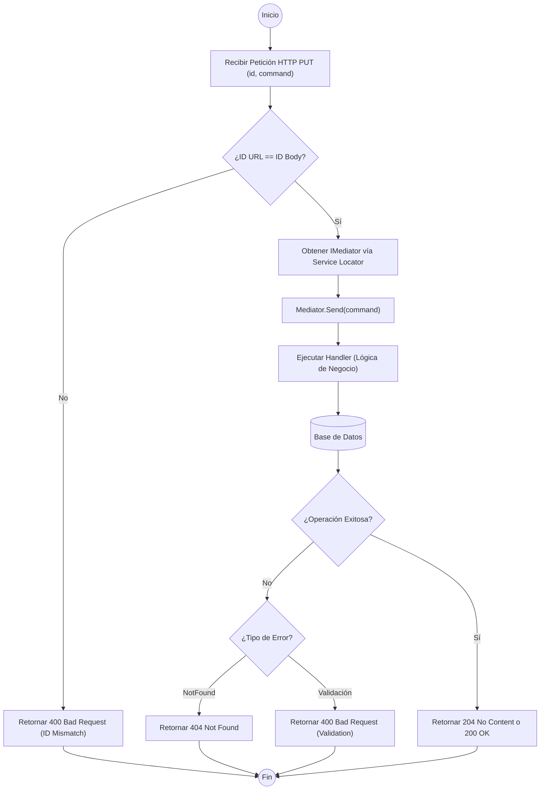

### ANÁLISIS TÉCNICO: MÉTODO UPDATE EN BASEAPICONTROLLER

El método `Update` en un controlador que hereda de `BaseApiController` utiliza el patrón **CQRS** (Command Query Responsibility Segregation) a través de la librería **MediatR**. La lógica se centra en la delegación de la operación de escritura a un "Handler" específico, manteniendo el controlador como una capa delgada de entrada/salida.

#### FLUJO DE EJECUCIÓN (MERMAID)

#### COMPONENTES LÓGICOS

| Componente | Responsabilidad Técnica |
| :--- | :--- |
| **Identity Validation** | Compara el parámetro de ruta `{id}` con la propiedad de identidad del objeto `Command` para asegurar integridad referencial. |
| **Service Locator** | La propiedad `Mediator` utiliza *Lazy Loading* y `HttpContext.RequestServices` para resolver la instancia de `IMediator` solo cuando es requerida. |
| **Command (DTO)** | Objeto que encapsula los datos de la actualización y es enviado a través del bus interno. |
| **MediatR Bus** | Desacopla la definición del endpoint de la implementación de la persistencia y reglas de negocio. |

#### CONSIDERACIONES DE EXCEPCIONES
1.  **Excepciones de Concurrencia**: Si dos usuarios modifican el mismo registro, el Handler debe capturar `DbUpdateConcurrencyException`.
2.  **Validación de Dominio**: Se recomienda el uso de `FluentValidation` en una capa previa al Handler (Pipeline Behaviors) para retornar errores 400 antes de tocar la base de datos.
3.  **Inyección de Dependencias**: El uso de `GetService<IMediator>()!` dentro de la propiedad protegida asegura que los controladores derivados no necesiten inyectar explícitamente el mediador en sus constructores, simplificando la herencia.