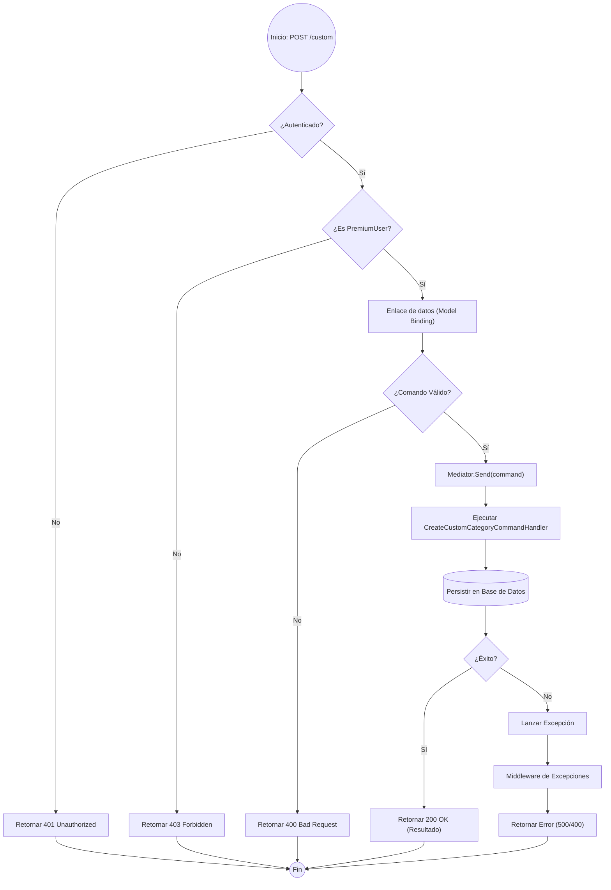

# Análisis Técnico: CategoriesController.CreateCustom

El método `CreateCustom` expone un punto de conexión (endpoint) para la creación de categorías personalizadas, restringido exclusivamente a usuarios con privilegios elevados. Implementa el patrón **CQRS** (Command Query Responsibility Segregation) mediante la librería **MediatR**.

## Flujo de Ejecución Detallado

1.  **Capa de Seguridad (Middleware):** El sistema valida el token JWT y verifica si el usuario posee el rol `PremiumUser`.
2.  **Capa de Control (Controller):** Recibe el DTO `CreateCustomCategoryCommand`.
3.  **Capa de Aplicación (Mediator):** Se desacopla la petición enviando el comando al manejador (Handler) correspondiente.
4.  **Procesamiento:** El Handler ejecuta la lógica de negocio, validaciones y persistencia en la base de datos.
5.  **Respuesta:** Se retorna un `200 OK` con el resultado de la operación o se delega el manejo de errores al middleware de excepciones.

## Diagrama de Flujo (Mermaid)

## Componentes Técnicos

| Componente | Responsabilidad |
| :--- | :--- |
| **AuthorizeAttribute** | Valida la identidad del usuario antes de entrar al método. |
| **RolesConstants** | Define de forma tipada el acceso para `PremiumUser`. |
| **Mediator** | Despacha el comando al `IRequestHandler` correspondiente, separando la infraestructura de la lógica. |
| **BaseApiController** | Clase base que provee la instancia de `IMediator` y utilidades comunes. |
| **IActionResult** | Abstracción de la respuesta HTTP devuelta al cliente. |