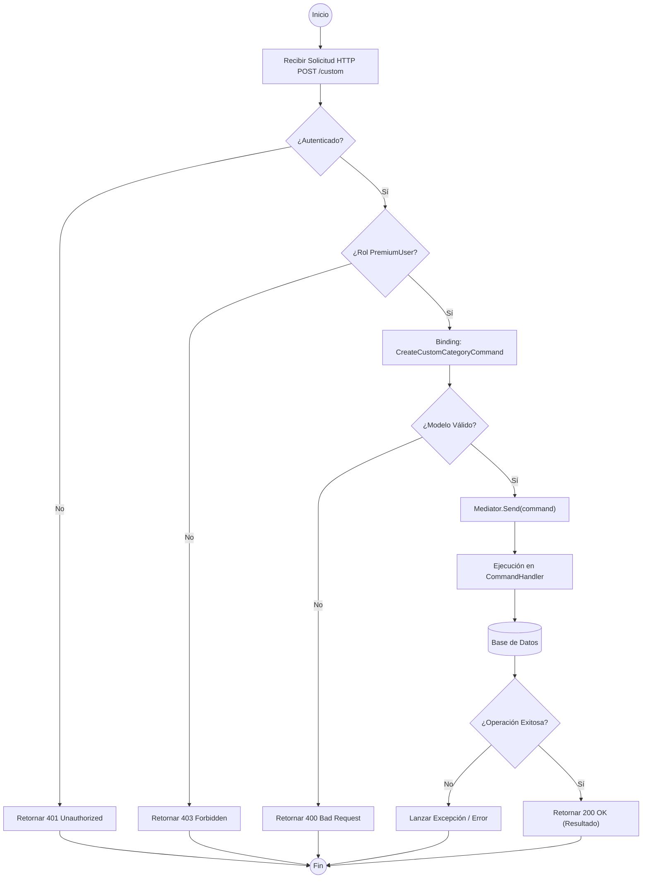

# ANÁLISIS TÉCNICO: CategoriesController.CreateCustom

## 1. DESCRIPCIÓN DE LA LÓGICA
El método `CreateCustom` expone un endpoint seguro para la creación de categorías personalizadas. Utiliza el patrón **CQRS** (Command Query Responsibility Segregation) a través de la librería **MediatR**. La seguridad está delegada a nivel de atributo, restringiendo el acceso únicamente a usuarios con el rol `PremiumUser`.

## 2. DIAGRAMA DE FLUJO DE EJECUCIÓN

## 3. ANÁLISIS DE COMPONENTES TÉCNICOS

| COMPONENTE | TIPO | DESCRIPCIÓN |
| :--- | :--- | :--- |
| **Versioning** | `ApiVersion("1.0")` | Define que el endpoint pertenece a la versión 1 de la API. |
| **Seguridad** | `Authorize(Roles = ...)` | Middleware que intercepta la petición para validar el JWT y el Claim de Rol. |
| **Patrón** | `Mediator` | Desacopla el controlador de la lógica de negocio, enviando el comando al manejador correspondiente. |
| **Contrato** | `CreateCustomCategoryCommand` | Objeto de transferencia de datos (DTO) que encapsula la intención de creación. |
| **Respuesta** | `IActionResult` | Retorna un envoltorio HTTP; en éxito devuelve un `Ok (200)` con el resultado del handler. |

## 4. CONSIDERACIONES DE ERROR
1.  **401 Unauthorized**: Si el token JWT es inválido o no está presente.
2.  **403 Forbidden**: Si el usuario está autenticado pero no posee el rol `PremiumUser` definido en `RolesConstants`.
3.  **400 Bad Request**: Si el cuerpo del JSON no coincide con la estructura de `CreateCustomCategoryCommand` o falla la validación (FluentValidation si está implementado).
4.  **500 Internal Server Error**: Ante excepciones no controladas durante la ejecución del Handler o la persistencia en base de datos.