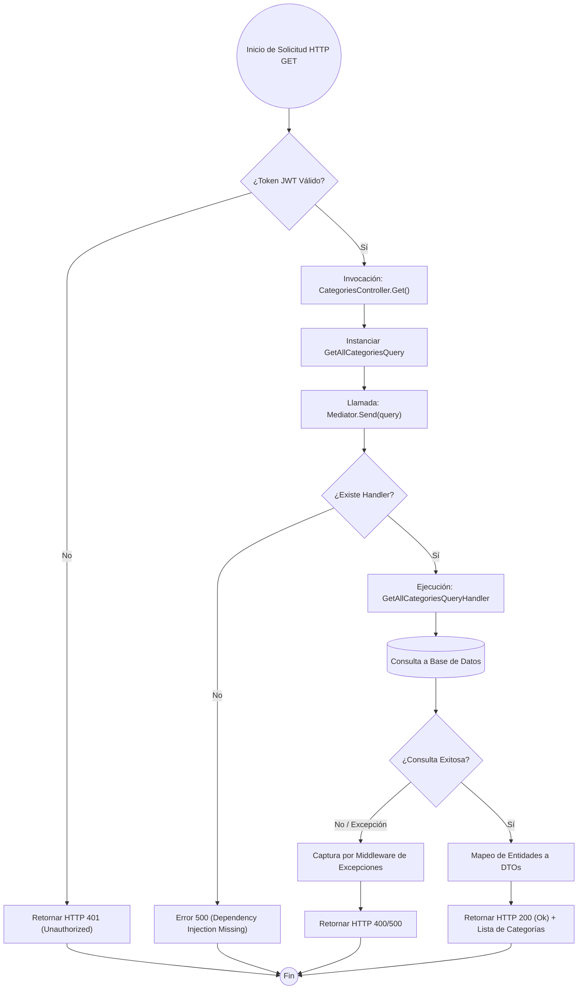

# ANALISIS TÉCNICO: CATEGORIESCONTROLLER - MÉTODO GET

El método `Get` del `CategoriesController` actúa como un punto de entrada (Endpoint) desacoplado mediante el patrón **Mediator**. Su función principal es despachar una consulta de lectura para obtener el catálogo de categorías.

## DIAGRAMA DE FLUJO DE EJECUCIÓN

## DETALLE DE COMPONENTES

| COMPONENTE | DESCRIPCIÓN TÉCNICA |
| :--- | :--- |
| **Atributo Authorize** | Middleware de seguridad que valida la identidad del usuario antes de ejecutar el controlador. |
| **Mediator (IMediator)** | Desacopla el controlador de la lógica de negocio, enviando el objeto `GetAllCategoriesQuery`. |
| **Query (CQRS)** | Objeto inmutable que representa la intención de lectura sin efectos secundarios. |
| **BaseApiController** | Clase padre que provee la instancia de `Mediator` mediante inyección de dependencias. |
| **GetAllCategoriesQuery** | Feature encargada de la persistencia y recuperación de datos de categorías. |

## FLUJO LÓGICO DE EXCEPCIONES
1.  **Error de Autenticación**: Si el encabezado `Authorization` es nulo o inválido, el flujo termina antes de entrar al controlador.
2.  **Fallo en Base de Datos**: Si el repositorio o contexto de datos falla, el `Mediator` propaga la excepción hacia el middleware global.
3.  **Respuesta Vacía**: Si no existen categorías, el sistema retorna un `200 OK` con una lista vacía, cumpliendo con la semántica REST para colecciones.