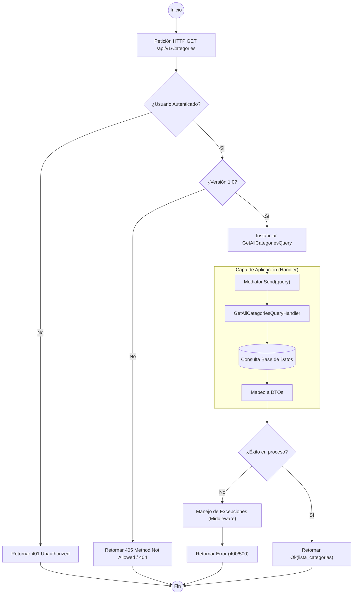

# ANÁLISIS TÉCNICO: CategoriesController.Get (GetAllCategories)

El método `Get` actúa como un punto de entrada (Endpoint) que delega la lógica de negocio a través del patrón **Mediator**. Utiliza un flujo desacoplado donde el controlador solo se encarga de recibir la petición, aplicar filtros de seguridad y retornar el resultado procesado por la capa de aplicación.

## FLUJO DE EJECUCIÓN (MERMAID)

## DETALLE DE COMPONENTES

| Componente | Responsabilidad |
| :--- | :--- |
| **Atributo [Authorize]** | Middleware de identidad que valida el JWT o Cookie antes de ejecutar la acción. |
| **ApiVersion("1.0")** | Restringe el acceso solo a clientes que especifiquen la versión 1.0 en la cabecera o URL. |
| **GetAllCategoriesQuery** | Objeto DTO (Data Transfer Object) de tipo Query que encapsula los parámetros de búsqueda (en este caso vacío). |
| **Mediator (IMediator)** | Desacopla el controlador del manejador de la consulta, permitiendo una arquitectura limpia (Clean Architecture). |
| **Task<IActionResult>** | Permite la ejecución asíncrona no bloqueante del hilo de ejecución de IIS/Kestrel. |

## LÓGICA DE ERROR
1.  **No Autenticado**: Si el token es inválido o no existe, el flujo termina en el middleware de autorización sin llegar al controlador.
2.  **Excepción en Handler**: Si la base de datos no está disponible o el mapeo falla, el `Mediator` propagará la excepción hacia el `Global Exception Filter` o `Middleware`, retornando un código de estado 500 o 400 según el tipo de error.