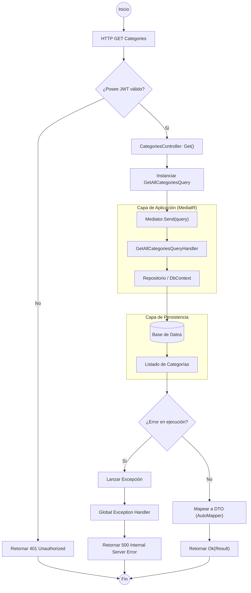

# Análisis Técnico: GetAllCategoriesQuery

### Flujo de Ejecución (Flowchart)

### Análisis de Componentes

| Componente | Responsabilidad |
| :--- | :--- |
| **CategoriesController** | Punto de entrada del API. Delega la lógica de negocio a MediatR para mantener el controlador "thin". |
| **Authorize Attribute** | Middleware de seguridad que valida la identidad del usuario antes de permitir el acceso al método. |
| **GetAllCategoriesQuery** | Objeto DTO (Data Transfer Object) que representa la intención de obtener todas las categorías. |
| **MediatR (Mediator)** | Desacopla la solicitud de su ejecución, enviando el comando/query al manejador correspondiente. |
| **Handler (Application)** | Contiene la lógica necesaria para interactuar con la persistencia y devolver los datos procesados. |

### Lógica de Ejecución

1.  **Validación de Identidad**: Al tener el atributo `[Authorize]`, el pipeline de ASP.NET Core verifica el token Bearer. Si no es válido, se detiene la ejecución inmediatamente.
2.  **Patrón CQRS**: El método implementa la separación de consultas (Queries). No modifica el estado del sistema, solo recupera información.
3.  **Inyección de Dependencias**: El controlador utiliza una propiedad `Mediator` (probablemente definida en `BaseApiController`) para procesar la solicitud.
4.  **Respuesta**: El resultado del Handler se encapsula en un `Ok()` de ASP.NET Core, generando un código de estado HTTP 200 y el cuerpo en formato JSON.