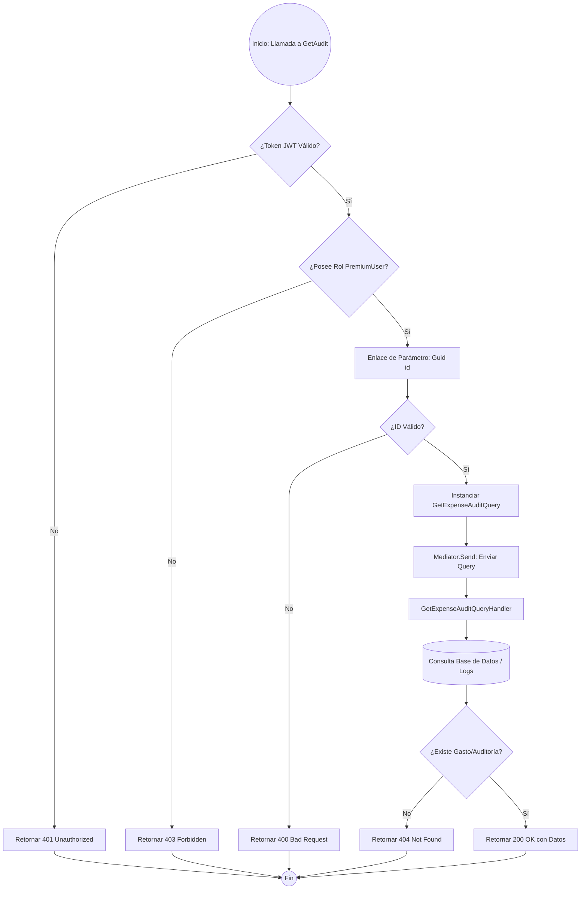

### Análisis Técnico: Método GetAudit

El método `GetAudit` actúa como un punto de entrada (Endpoint) para la consulta de trazabilidad de un gasto específico. Utiliza un patrón de diseño basado en **Mediator** para desacoplar la capa de transporte (Web API) de la lógica de negocio (Application Layer), delegando la ejecución a un manejador de consultas (Query Handler).

### Diagrama de Flujo de Ejecución (Mermaid)

### Descripción de la Lógica Operacional

1.  **Seguridad y Autorización**: Antes de ejecutar cualquier código dentro del método, el middleware de ASP.NET Core evalúa el atributo `[Authorize(Roles = RolesConstants.PremiumUser)]`. Si el usuario no está autenticado o no posee el rol requerido, la ejecución se interrumpe prematuramente.
2.  **Encapsulamiento de la Petición**: El `Guid id` recibido por la URL se encapsula en un objeto de tipo `GetExpenseAuditQuery`. Este objeto actúa como un DTO (Data Transfer Object) de entrada para la capa de aplicación.
3.  **Patrón Mediator**: El controlador no conoce la lógica de cómo obtener la auditoría. Utiliza la interfaz `IMediator` para enviar el comando de consulta. Esto permite que el controlador sea "delgado" (Thin Controller).
4.  **Procesamiento (Handler)**: Aunque no se muestra el código del Handler en el contexto, la lógica implica que un manejador específico interceptará la query, consultará la persistencia (frecuentemente una tabla de auditoría o histórico) y devolverá el resultado.
5.  **Respuesta**: El resultado se envuelve en un método `Ok()`, que genera una respuesta HTTP 200 con el cuerpo serializado en JSON. Los errores de infraestructura o de negocio (como no encontrar el ID) son gestionados por los filtros de excepción globales o el propio handler, derivando en los códigos de estado correspondientes.

### Tabla de Componentes

| Componente | Responsabilidad |
| :--- | :--- |
| `AuthorizeAttribute` | Filtro de seguridad que valida el rol `PremiumUser`. |
| `GetExpenseAuditQuery` | Objeto de consulta que transporta el `ExpenseId`. |
| `Mediator.Send` | Despachador que localiza el manejador de la consulta. |
| `IActionResult` | Abstracción del resultado HTTP devuelto al cliente. |