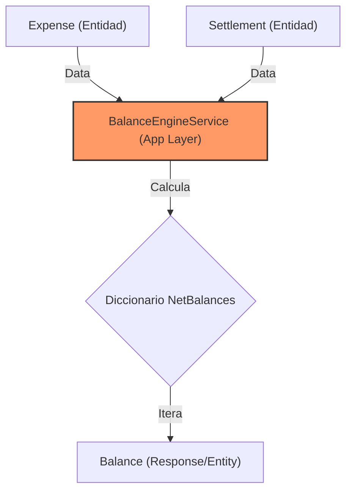

# ANALISIS TÉCNICO DE ARQUITECTURA - SISTEMA DE GASTOS COMPARTIDOS

## 1. Deuda Técnica e Identificación de Problemas

| Problema | Impacto | Descripción Técnica |
| :--- | :--- | :--- |
| **Lógica de Dominio en Aplicación** | Alto | `BalanceEngineService` reside en la capa de Aplicación, pero contiene reglas matemáticas críticas del negocio que pertenecen al Dominio. |
| **Inconsistencia de Fechas** | Medio | `BaseEntity` inicializa `Created` con `DateTime.Now`. Esto rompe la consistencia con `IDateTimeService` y causa problemas en despliegues multi-región. |
| **Duplicidad de Modelos** | Medio | Existencia de `Models.Request` y `Application.Features._auth.DTOs.Request`. Hay una mezcla entre DTOs de MediatR y modelos de transporte. |
| **Acoplamiento de Esquema** | Bajo | El campo `PayerId` en `Expense` se marca como "legacy" frente a la tabla `Payments`, pero ambos coexisten, lo que genera ambigüedad en los cálculos. |

### Flujo de Cálculo de Balances (Estado Actual)


## 2. Nuevas Funcionalidades Sugeridas

1.  **Soporte Multimoneda Real**: Implementar una entidad `ExchangeRate` y un servicio que convierta gastos de diferentes divisas a una divisa base del grupo.
2.  **Gastos Recurrentes**: Agregar un motor de tareas programadas (Hangfire/Quartz) que genere `Expense` automáticamente basado en un cron-expression.
3.  **Sistema de Notificaciones**: Integrar un patrón Observer o MediatR Notifications para alertar vía Email/Push cuando se añade un gasto o se solicita una liquidación.
4.  **Gestión de Archivos**: Adjuntar imágenes de comprobantes (tickets) mediante un servicio de almacenamiento (Azure Blob Storage / AWS S3).

## 3. Cumplimiento de Buenas Prácticas (Modificaciones)

### Capa de Dominio
- **Entidades Ricas**: Mover la lógica de `BalanceEngineService` a un **Domain Service** o dentro de la entidad `Group`.
- **Value Objects**: Transformar `Currency` y `Money` (Amount + Currency) en Value Objects para asegurar la integridad monetaria.

### Capa de Persistencia
- **Intercepción de Auditoría**: Implementar un `SaveChangesInterceptor` en Entity Framework para poblar automáticamente `CreatedBy`, `Created`, `LastModifiedBy` usando el `IAuthenticatedUserService`.

### Capa de Aplicación
- **Consolidación de DTOs**: Eliminar la carpeta `Models` externa y centralizar todo en `Application.Features.[Feature].DTOs`.

## 4. Refactorización (Eliminación y Simplificación)

1.  **Eliminar `PayerId` en `Expense`**: La relación debe ser exclusivamente a través de la colección `Payments` para soportar pagos compartidos nativamente.
2.  **Simplificar `BalanceEngineService`**: Utilizar LINQ optimizado para el cálculo de deudas netas en lugar de múltiples bucles anidados con diccionarios manuales.
3.  **GeneralProfile (AutoMapper)**: Evaluar el uso de `ProjectTo<T>` en las Queries para evitar la carga en memoria de entidades completas antes del mapeo.

## 5. 🚀 PROMPT DE APLICACIÓN

Copia y pega el siguiente bloque en tu IA asistente para ejecutar las mejoras:

```text
Actúa como un desarrollador experto en .NET 8, Clean Architecture y DDD. Debes refactorizar el código actual siguiendo estas instrucciones técnicas:

1. AUDITORÍA AUTOMÁTICA: Modifica 'BaseEntity.cs' para que las propiedades 'Created' y 'LastModified' no tengan valores por defecto. Implementa un interceptor en 'ApplicationDbContext' que use 'IDateTimeService' e 'IAuthenticatedUserService' para llenar estos campos automáticamente al hacer SaveChangesAsync.

2. REFACTORIZACIÓN DE BALANCE: Mueve la lógica de 'BalanceEngineService.cs' a un servicio de dominio. Optimiza el método 'CalculateSimplifiedBalances' usando LINQ para agrupar pagos y splits. Asegúrate de eliminar la dependencia de 'expense.PayerId' y usa únicamente la colección 'expense.Payments'.

3. LIMPIEZA DE MODELOS: Mueve todos los archivos dentro de la carpeta 'Models/Request' y 'Models/Response' a sus respectivas carpetas dentro de 'Application/Features/_auth/DTOs', 'Application/Features/_expenses/DTOs', etc. Actualiza todos los namespaces y referencias en los Controllers y Handlers.

4. VALIDACIÓN ESTRICTA: Asegúrate de que todos los Commands en 'Application/Features' tengan una clase 'Validator' asociada usando FluentValidation. Si falta alguno, genéralo basándote en las propiedades del Command (ej. Totales mayores a 0, Strings no vacíos).

5. VALUE OBJECTS: Crea un Value Object 'Money' que contenga 'Amount' (decimal) y 'Currency' (string). Reemplaza las propiedades sueltas de monto y moneda en 'Expense' y 'Settlement' por este nuevo Value Object.

Entregable: Genera el código modificado para los archivos afectados siguiendo las mejores prácticas de C#.
```