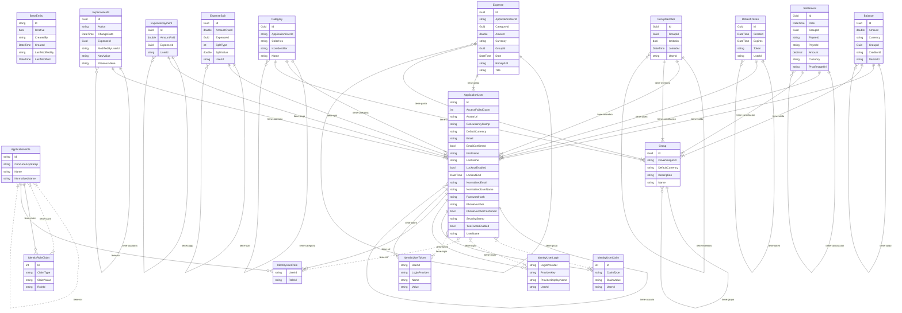
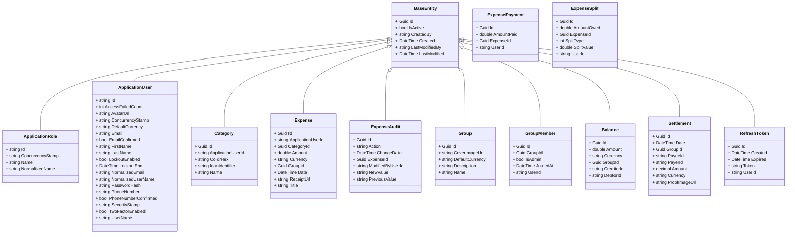

### Diagrama de Relación-Entidad

```mermaid
erDiagram
    BaseEntity {
        string Id
        bool IsActive
        string CreatedBy
        DateTime Created
        string LastModifiedBy
        DateTime LastModified
    }

    ApplicationRole ||--o{ ApplicationRole : tiene-rol
    ApplicationRole {
        string Id
        string ConcurrencyStamp
        string Name
        string NormalizedName
    }

    ApplicationRole }|..|{ IdentityRoleClaim : tiene-claim
    IdentityRoleClaim {
        int Id
        string ClaimType
        string ClaimValue
        string RoleId
    }

    ApplicationUser ||--o{ ApplicationUser : tiene-usuario
    ApplicationUser {
        string Id
        int AccessFailedCount
        string AvatarUrl
        string ConcurrencyStamp
        string DefaultCurrency
        string Email
        bool EmailConfirmed
        string FirstName
        string LastName
        bool LockoutEnabled
        DateTime LockoutEnd
        string NormalizedEmail
        string NormalizedUserName
        string PasswordHash
        string PhoneNumber
        bool PhoneNumberConfirmed
        string SecurityStamp
        bool TwoFactorEnabled
        string UserName
    }

    ApplicationUser }|..|{ IdentityUserClaim : tiene-claim
    IdentityUserClaim {
        int Id
        string ClaimType
        string ClaimValue
        string UserId
    }

    ApplicationUser }|..|{ IdentityUserLogin : tiene-login
    IdentityUserLogin {
        string LoginProvider
        string ProviderKey
        string ProviderDisplayName
        string UserId
    }

    ApplicationUser }|..|{ IdentityUserRole : tiene-rol
    IdentityUserRole {
        string UserId
        string RoleId
    }

    ApplicationUser }|..|{ IdentityUserToken : tiene-token
    IdentityUserToken {
        string UserId
        string LoginProvider
        string Name
        string Value
    }

    Category ||--o{ Category : tiene-categoria
    Category {
        Guid Id
        string ApplicationUserId
        string ColorHex
        string IconIdentifier
        string Name
    }

    Expense ||--o{ Expense : tiene-gasto
    Expense {
        Guid Id
        string ApplicationUserId
        Guid CategoryId
        double Amount
        string Currency
        Guid GroupId
        DateTime Date
        string ReceiptUrl
        string Title
    }

    ExpenseAudit ||--o{ ExpenseAudit : tiene-auditoria
    ExpenseAudit {
        Guid Id
        string Action
        DateTime ChangeDate
        Guid ExpenseId
        string ModifiedByUserId
        string NewValue
        string PreviousValue
    }

    ExpensePayment ||--o{ ExpensePayment : tiene-pago
    ExpensePayment {
        Guid Id
        double AmountPaid
        Guid ExpenseId
        string UserId
    }

    ExpenseSplit ||--o{ ExpenseSplit : tiene-split
    ExpenseSplit {
        Guid Id
        double AmountOwed
        Guid ExpenseId
        int SplitType
        double SplitValue
        string UserId
    }

    Group ||--o{ Group : tiene-grupo
    Group {
        Guid Id
        string CoverImageUrl
        string DefaultCurrency
        string Description
        string Name
    }

    GroupMember ||--o{ GroupMember : tiene-miembro
    GroupMember {
        Guid Id
        Guid GroupId
        bool IsAdmin
        DateTime JoinedAt
        string UserId
    }

    Balance ||--o{ Balance : tiene-saldo
    Balance {
        Guid Id
        double Amount
        string Currency
        Guid GroupId
        string CreditorId
        string DebtorId
    }

    Settlement ||--o{ Settlement : tiene-conciliacion
    Settlement {
        Guid Id
        DateTime Date
        Guid GroupId
        string PayeeId
        string PayerId
        decimal Amount
        string Currency
        string ProofImageUrl
    }

    RefreshToken ||--o{ RefreshToken : tiene-token
    RefreshToken {
        Guid Id
        DateTime Created
        DateTime Expires
        string Token
        string UserId
    }

    ApplicationRole }|..|{ ApplicationRole : tiene-rol
    ApplicationRole ||--o{ IdentityRoleClaim : tiene-claim

    ApplicationRole }|..|{ ApplicationRole : tiene-rol
    ApplicationRole ||--o{ IdentityUserRole : tiene-rol

    ApplicationUser ||--o{ IdentityUserClaim : tiene-claim
    ApplicationUser ||--o{ IdentityUserLogin : tiene-login
    ApplicationUser ||--o{ IdentityUserRole : tiene-rol
    ApplicationUser ||--o{ IdentityUserToken : tiene-token

    Balance ||--|{ ApplicationUser : tiene-saldo
    Category ||--|{ ApplicationUser : tiene-categoria
    Expense ||--|{ ApplicationUser : tiene-gasto
    ExpenseAudit ||--|{ ApplicationUser : tiene-auditoria
    ExpensePayment ||--|{ ApplicationUser : tiene-pago
    ExpenseSplit ||--|{ ApplicationUser : tiene-split
    GroupMember ||--|{ ApplicationUser : tiene-miembro
    RefreshToken ||--|{ ApplicationUser : tiene-token
    Settlement ||--|{ ApplicationUser : tiene-conciliacion

    Category ||--|{ Group : tiene-categoria
    Expense ||--|{ Group : tiene-gasto
    Balance ||--|{ Group : tiene-saldo
    Settlement ||--|{ Group : tiene-conciliacion
    GroupMember ||--|{ Group : tiene-miembro
```

### Diagrama de Clases

```mermaid
classDiagram
    class BaseEntity {
        + Guid Id
        + bool IsActive
        + string CreatedBy
        + DateTime Created
        + string LastModifiedBy
        + DateTime LastModified
    }

    class ApplicationRole {
        + string Id
        + string ConcurrencyStamp
        + string Name
        + string NormalizedName
    }

    class ApplicationUser {
        + string Id
        + int AccessFailedCount
        + string AvatarUrl
        + string ConcurrencyStamp
        + string DefaultCurrency
        + string Email
        + bool EmailConfirmed
        + string FirstName
        + string LastName
        + bool LockoutEnabled
        + DateTime LockoutEnd
        + string NormalizedEmail
        + string NormalizedUserName
        + string PasswordHash
        + string PhoneNumber
        + bool PhoneNumberConfirmed
        + string SecurityStamp
        + bool TwoFactorEnabled
        + string UserName
    }

    class Category {
        + Guid Id
        + string ApplicationUserId
        + string ColorHex
        + string IconIdentifier
        + string Name
    }

    class Expense {
        + Guid Id
        + string ApplicationUserId
        + Guid CategoryId
        + double Amount
        + string Currency
        + Guid GroupId
        + DateTime Date
        + string ReceiptUrl
        + string Title
    }

    class ExpenseAudit {
        + Guid Id
        + string Action
        + DateTime ChangeDate
        + Guid ExpenseId
        + string ModifiedByUserId
        + string NewValue
        + string PreviousValue
    }

    class ExpensePayment {
        + Guid Id
        + double AmountPaid
        + Guid ExpenseId
        + string UserId
    }

    class ExpenseSplit {
        + Guid Id
        + double AmountOwed
        + Guid ExpenseId
        + int SplitType
        + double SplitValue
        + string UserId
    }

    class Group {
        + Guid Id
        + string CoverImageUrl
        + string DefaultCurrency
        + string Description
        + string Name
    }

    class GroupMember {
        + Guid Id
        + Guid GroupId
        + bool IsAdmin
        + DateTime JoinedAt
        + string UserId
    }

    class Balance {
        + Guid Id
        + double Amount
        + string Currency
        + Guid GroupId
        + string CreditorId
        + string DebtorId
    }

    class Settlement {
        + Guid Id
        + DateTime Date
        + Guid GroupId
        + string PayeeId
        + string PayerId
        + decimal Amount
        + string Currency
        + string ProofImageUrl
    }

    class RefreshToken {
        + Guid Id
        + DateTime Created
        + DateTime Expires
        + string Token
        + string UserId
    }

    BaseEntity <|-- ApplicationRole
    BaseEntity <|-- ApplicationUser
    BaseEntity <|-- Category
    BaseEntity <|-- Expense
    BaseEntity <|-- ExpenseAudit
    BaseEntity <|-- Group
    BaseEntity <|-- GroupMember
    BaseEntity <|-- Balance
    BaseEntity <|-- Settlement
    BaseEntity <|-- RefreshToken
```